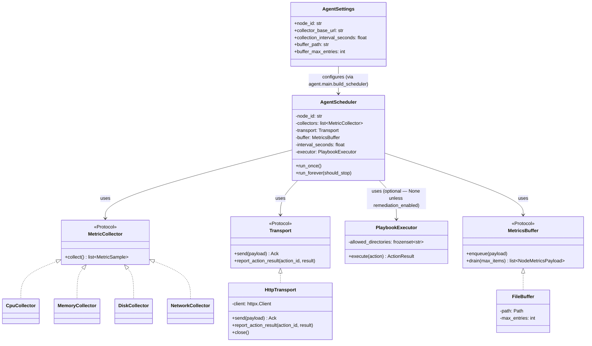
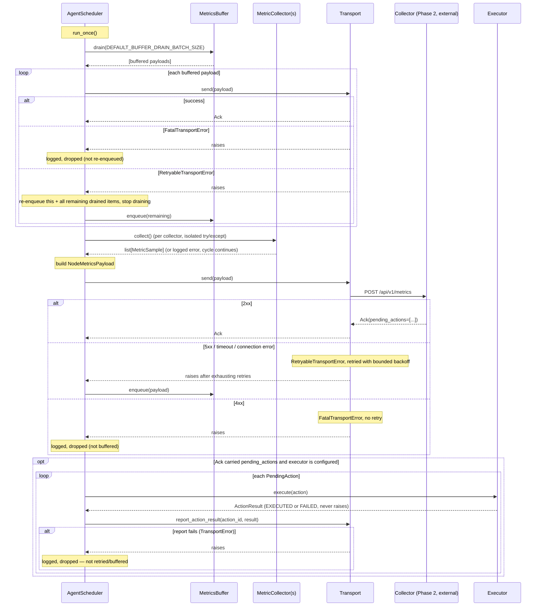

# Agent — Architecture

Related: `docs/architecture/00-project-initialization.md` (project-wide design),
`docs/adr/001-push-vs-pull.md`, `docs/adr/004-agent-buffering.md`,
`docs/adr/011-http-vs-message-queue.md`, `docs/adr/012-python-tech-stack.md`,
`docs/adr/007-remediation-safety.md`, `docs/adr/020-remediation-dispatch-mechanism.md`,
`docs/adr/021-remediation-playbook-scope.md`.

## Overview

The Agent is a single-threaded, sequential process: one collection-and-delivery cycle
runs to completion before the next begins. There is no concurrency inside a cycle, and no
overlap between cycles — a slow cycle simply delays the next tick rather than running
alongside it. This keeps the Agent's dependency footprint and runtime model deliberately
simple (`docs/adr/012-python-tech-stack.md`): `httpx` + `psutil` + `pydantic` only, no
FastAPI or SQLAlchemy.

## Class diagram

`MetricCollector`, `Transport`, and `MetricsBuffer` are `Protocol`s defined in
`shared/protocols.py` — `AgentScheduler` depends only on those abstractions
(Dependency Inversion), never on the concrete `Http Transport`/`FileBuffer`/collector
classes directly. This is what makes it possible to unit test the scheduler with fakes
(see `tests/unit/agent/test_scheduler.py`) with no network or filesystem I/O.

## Sequence diagram — one collection cycle

Pending actions are only executed for the *current* cycle's fresh delivery (the `send`
call in this diagram) — not for the buffered-payload redelivery loop above it, whose
`Ack` responses are received but not inspected for `pending_actions`. See
`docs/adr/020-remediation-dispatch-mechanism.md`.

## Design rationale (why sequential, not async)

`psutil` calls are blocking anyway, and there is exactly one Collector target per Agent —
concurrency inside a cycle would add complexity (thread/async safety in the buffer file,
overlapping cycle handling) without a corresponding benefit at this scale. See
`docs/architecture/00-project-initialization.md` §5 tradeoffs.

## Failure modes handled here

See `docs/architecture/00-project-initialization.md` §10 and the Phase 1 design
conversation for the full table. Summary: a single failing collector never blocks the
others; a down Collector triggers bounded retry then buffering; a buffer write/read
failure is logged and treated as empty/dropped rather than crashing the process; a
malformed-payload rejection (4xx) is dropped rather than retried forever.

## Future Extension Notes

- **Authentication** (`docs/adr/005-authentication.md`, Phase 2): `HttpTransport` will
  need a header-injection seam for a bearer token / mTLS client cert — currently sends
  unauthenticated requests.
- **Multi-mount disk collection**: `DiskCollector` currently monitors a single configured
  mount point (default `/`). Monitoring multiple mounts would mean either multiple
  `DiskCollector` instances (one per mount, no code change needed — it already accepts a
  `mount_path` constructor argument) or a `DiskCollector` that iterates
  `psutil.disk_partitions()`.
- **Async scheduler**: if the Agent ever needs to collect from many independent targets
  concurrently (unlikely for a single-node Agent, more plausible for a future
  "supervisor" mode), the sequential model here would need revisiting — not a Phase 1
  concern.
- **Stronger node identity** (`docs/adr/003-heartbeat-deadman-switch.md`, Phase 2):
  hostname-based `node_id` is not collision-proof across cloned VM images; a
  generated-and-persisted UUID is the likely successor.
- **Heartbeat**: Phase 2's dead-man-switch design may add a lightweight heartbeat-only
  push (distinct from a full metrics payload) on a separate, shorter interval.
- **A privileged `RESTART_SERVICE` executor** (Phase 5): needs its own privilege model
  (root, scoped sudoers/polkit, or a privileged helper process) — see
  `docs/adr/021-remediation-playbook-scope.md`. `PlaybookExecutor` is already structured
  so a new `agent/remediation/actions/` handler is additive, not a redesign.
- **Retry/buffering for failed remediation result reports** (Phase 5): currently logged
  and dropped on failure, unlike metrics payloads which buffer via `FileBuffer`.
- **Executing pending actions from buffered/redelivered payloads** (Phase 5): currently
  only the current cycle's fresh delivery triggers execution — a deliberate scope
  boundary for this phase, not a hard architectural limit.
