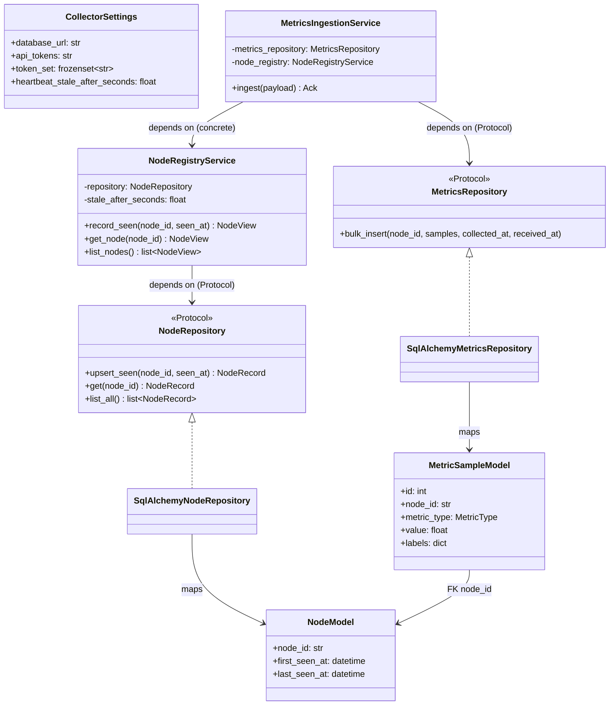
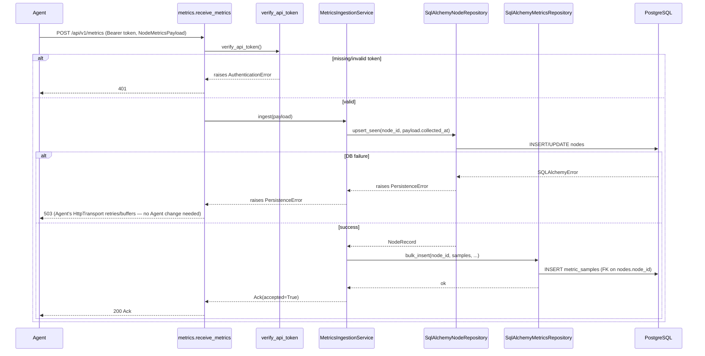
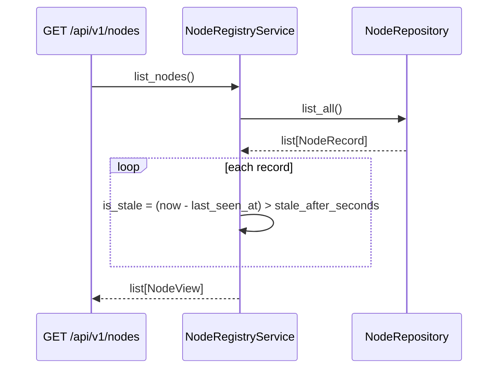

# Collector — Architecture

Related: `docs/architecture/00-project-initialization.md` (project-wide design),
`docs/adr/002-postgresql-choice.md`, `docs/adr/003-heartbeat-deadman-switch.md`,
`docs/adr/005-authentication.md`, `docs/adr/016-database-migration-strategy.md`,
`docs/adr/017-collector-sync-vs-async-db.md`.

## Overview

The Collector is a FastAPI service layered as: **routes** (HTTP-facing, thin) → **services**
(business logic, framework-agnostic) → **repositories** (SQLAlchemy, the only layer that
knows about the database). Each layer depends only on the abstraction the layer below it
exposes — routes depend on services via FastAPI `Depends`, services depend on repository
`Protocol`s, never on SQLAlchemy or FastAPI directly. This mirrors the Agent's
`AgentScheduler` depending on `shared.protocols`, not concrete classes
(`agent/architecture.md`).

## Class diagram

`NodeView` (a plain dataclass returned by `NodeRegistryService`) is distinct from
`NodeRead` (the Pydantic model `collector/api/schemas.py` serializes to JSON) — the
service layer never imports Pydantic/FastAPI, and the API layer never imports SQLAlchemy
models directly.

## Sequence diagram — metrics ingestion

The registry update happens **before** the metrics insert deliberately:
`metric_samples.node_id` has a foreign key on `nodes.node_id`, so the node row must exist
first — true even on a node's very first-ever push, since nodes are never pre-provisioned
(`docs/adr/003-heartbeat-deadman-switch.md`).

## Sequence diagram — node registry read (staleness)

No background job computes staleness — it's derived at read time, every time. There is
no scheduler inside the Collector in Phase 2; alerting on stale nodes is explicitly
Phase 3/4's job (Rule Engine, Alert Manager), not this service's.

## Why sync SQLAlchemy (not async)

FastAPI runs sync `def` route handlers in a threadpool automatically, so synchronous
repository code doesn't block the event loop. Given Phase 2's expected request volume
(occasional pushes from a moderate node fleet, not high-frequency trading), the
complexity of `AsyncSession` (async repository methods, async test fixtures) wasn't
justified yet. See `docs/adr/017-collector-sync-vs-async-db.md`.

## Why Alembic, not `create_all()`

`Base.metadata.create_all()` has no history, no rollback path, and no story for applying
incremental schema changes to a running production database. Alembic's initial migration
(`collector/db/migrations/versions/0001_initial_schema.py`) is hand-written, not
autogenerated, since there's no live database in this environment to diff against — see
`docs/adr/016-database-migration-strategy.md`.

## Known limitation: shared-token auth doesn't bind identity

Any request bearing a valid token authenticates as "a legitimate Agent" — there is no
binding between a specific token and a specific `node_id`. A compromised or misconfigured
Agent could push data claiming another node's identity. This is a deliberate, documented
tradeoff (`docs/adr/005-authentication.md`), not an oversight — per-node credentials is
the natural next step once TLS/RBAC (`.claude/PROJECT.md` Future Features) are tackled.

## Future Extension Notes

- **Per-node credentials**: replace the shared-token model once TLS/RBAC land, closing
  the identity-spoofing gap above.
- **Async DB access**: revisit if profiling shows threadpool contention under real load.
- **Alerting on staleness**: Phase 3/4's Rule Engine is expected to poll
  `NodeRegistryService.list_nodes()` (or a dedicated query) and raise alerts for nodes
  that cross the staleness threshold — no Collector-side change anticipated beyond
  possibly exposing a narrower "stale nodes only" query if polling all nodes doesn't scale.
- **Metric queries**: `MetricsRepository` is currently write-only (`bulk_insert`); the
  Rule Engine will need read methods (e.g. "latest N samples for node X, metric Y") added
  to the same repository, not a parallel one.
- **Rate limiting**: not implemented; noted as a gap if the Collector is ever exposed
  beyond a trusted network.
