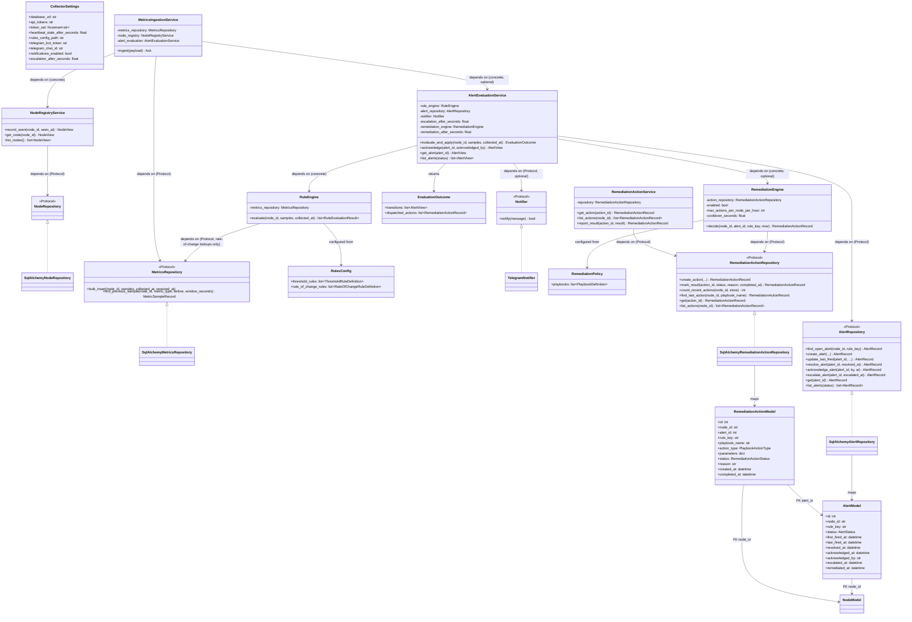
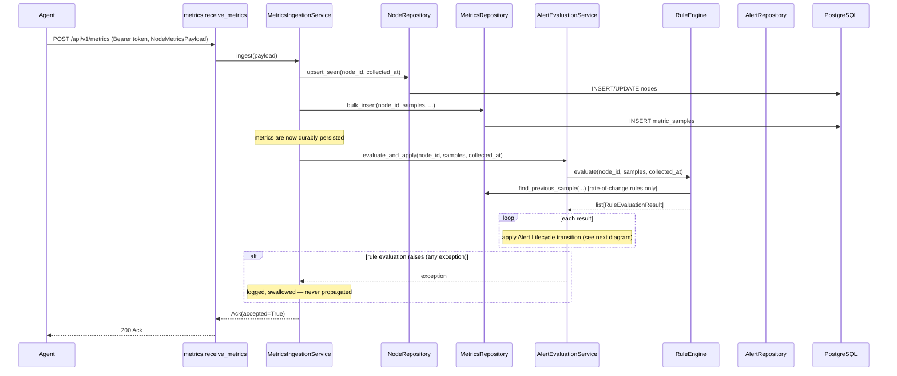
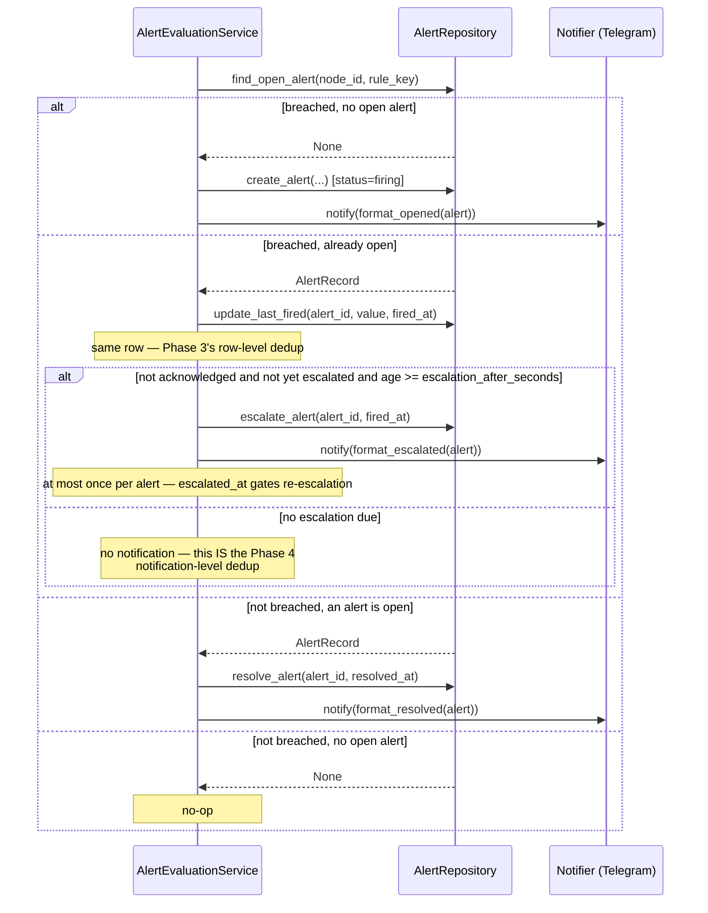
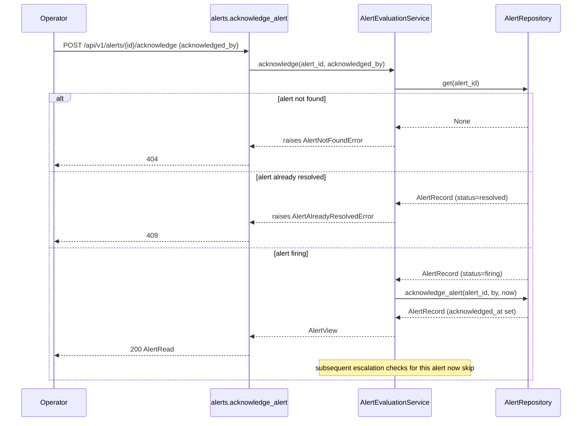
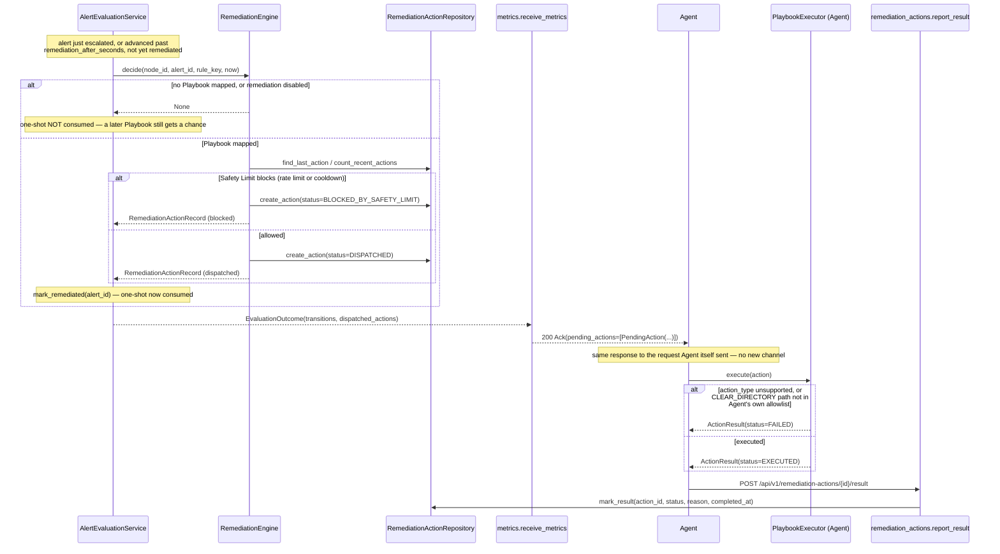

# Collector — Architecture

Related: `docs/architecture/00-project-initialization.md` (project-wide design),
`docs/adr/002-postgresql-choice.md`, `docs/adr/003-heartbeat-deadman-switch.md`,
`docs/adr/005-authentication.md`, `docs/adr/006-alert-lifecycle.md`,
`docs/adr/016-database-migration-strategy.md`, `docs/adr/017-collector-sync-vs-async-db.md`,
`docs/adr/018-telegram-notifications.md`, `docs/adr/019-alert-acknowledgement-escalation.md`,
`docs/adr/007-remediation-safety.md`, `docs/adr/020-remediation-dispatch-mechanism.md`,
`docs/adr/021-remediation-playbook-scope.md`.

## Overview

The Collector is a FastAPI service layered as: **routes** (HTTP-facing, thin) → **services**
(business logic, framework-agnostic) → **repositories** (SQLAlchemy, the only layer that
knows about the database). Each layer depends only on the abstraction the layer below it
exposes — routes depend on services via FastAPI `Depends`, services depend on repository
`Protocol`s, never on SQLAlchemy or FastAPI directly. This mirrors the Agent's
`AgentScheduler` depending on `shared.protocols`, not concrete classes
(`agent/architecture.md`).

The Rule Engine (`collector/rules/`) and Notifications (`collector/notifications/`) are
peers of `repositories/`, not sub-layers of it — all three are consumed by `services/`.
`collector/enums.py` exists specifically so `rules/` and `repositories/` (two peers,
neither of which should depend on the other) can share the `RuleKind`/`AlertStatus`
vocabulary. `collector/notifications/formatting.py` uses a structural `Protocol`
(`_AlertLike`) rather than importing `AlertView` from `services/`, for the same reason:
`services/` calls into `notifications/`, so the reverse import would be circular.

## Class diagram

`NodeView`/`AlertView` (plain dataclasses returned by services) are distinct from
`NodeRead`/`AlertRead` (the Pydantic models `collector/api/schemas.py` serializes to
JSON) — the service layer never imports Pydantic/FastAPI, and the API layer never
imports SQLAlchemy models directly.

## Sequence diagram — metrics ingestion + rule evaluation

**Rule evaluation is best-effort by design.** It runs strictly *after* the metrics
transaction succeeds, and any exception from it — `PersistenceError` or a genuine bug
(`AttributeError`, `RuntimeError`, ...) — is caught, logged, and never surfaced as a
failed ingestion. This matters because the Agent's `HttpTransport` treats a non-2xx
response as retryable-or-fatal (`docs/adr/011-http-vs-message-queue.md`); a Rule Engine
bug must never cause the Agent to retry-storm re-delivering metrics that were already
safely persisted.

## Sequence diagram — Alert Lifecycle, escalation, and notification

`AlertStatus` is unchanged (`firing`/`resolved`) — acknowledgement is an **orthogonal**
attribute (`acknowledged_at`/`acknowledged_by`), not a third status value. An alert can be
`firing` *and* acknowledged simultaneously; only the rule no longer breaching resolves it.
See `docs/adr/019-alert-acknowledgement-escalation.md`.

## Sequence diagram — remediation dispatch and result reporting

Two independent opt-ins gate this entire flow: the Collector only calls `RemediationEngine
.decide` with `enabled=True` (its own `remediation_enabled`), and the Agent only
constructs a `PlaybookExecutor` at all when *its own* `remediation_enabled` is true — both
default `False`. See `docs/adr/007-remediation-safety.md`.

## Why rule evaluation (and escalation) is ingestion-triggered, not scheduled

Rule evaluation happens synchronously, inline with `POST /api/v1/metrics`, immediately
after persistence succeeds — and the escalation check rides along the same path (folded
into the "still breaching, advance" step). This avoids coupling the alerting hot path to
a scheduler, at the cost of two related, still-open gaps: a node that goes completely
silent is never re-evaluated (no staleness *alerting*, though `is_stale` is computed),
and a firing alert on a silent node never escalates either. Since Phase 6 a background
scheduler *does* exist (see below) — these gaps are now "job not yet written," no longer
"no scheduler exists."

## Background jobs: `collector/jobs/` (Phase 6)

`PeriodicJobScheduler` (`jobs/scheduler.py`) is a daemon thread started/stopped by the
FastAPI lifespan; it wakes on an interval and runs registered jobs sequentially, with
per-job failure containment (one failing job is logged and retried next tick, never
kills the loop or starves other jobs). A thread, not asyncio, because the whole
persistence stack is sync SQLAlchemy (`docs/adr/017-collector-sync-vs-async-db.md`).

`RetentionJob` (`jobs/retention.py`) is the first registered job — opt-in
(`retention_enabled=false` default), it prunes in FK-safe order (terminal
`remediation_actions` → resolved unreferenced `alerts` → `metric_samples`) in
batch-bounded, per-batch-committed DELETEs, so interruption at any point loses nothing.
Firing alerts and `DISPATCHED` audit rows are never pruned, at any age. See
`docs/adr/010-retention-policy.md`.

## Why rules are a JSON config file, not a database

`ROADMAP.md` names "Threshold Rules" and "Rate-of-change Rules," not a rule-management
API. A file, loaded once at startup (`collector/rules/loader.py`, stdlib `json`, zero new
dependency), fails Collector startup fast (`ConfigurationError`) on malformed content or
a duplicate rule for the same `(metric_type, kind)`. See `docs/adr/006-alert-lifecycle.md`.

## Why Telegram delivery is fire-and-forget, not retried

`TelegramNotifier.notify()` makes a single attempt and never raises — any failure
(network error, non-2xx response) is caught and logged internally. The alert's state is
already durably persisted in Postgres *before* any notification is attempted
(`create_alert`/`escalate_alert`/`resolve_alert` all happen first), so a Telegram outage
only costs the notice, never the alert record itself. No retry-with-backoff (unlike the
Agent's `HttpTransport`) since there's nothing to protect by retrying — the durable state
was never at risk. See `docs/adr/018-telegram-notifications.md`.

## Why sync SQLAlchemy (not async)

FastAPI runs sync `def` route handlers in a threadpool automatically, so synchronous
repository code doesn't block the event loop. Given the Collector's expected request
volume (occasional pushes from a moderate node fleet, not high-frequency trading), the
complexity of `AsyncSession` (async repository methods, async test fixtures) wasn't
justified yet. See `docs/adr/017-collector-sync-vs-async-db.md`.

## Why Alembic, not `create_all()`

`Base.metadata.create_all()` has no history, no rollback path, and no story for applying
incremental schema changes to a running production database. All three migrations
(`0001_initial_schema.py`, `0002_alerts_table.py`, `0003_alert_acknowledgement_escalation.py`)
are hand-written, not autogenerated. Originally verified only via generated offline SQL
(`alembic upgrade head --sql`); later applied for real against a live PostgreSQL 16
container, with the Collector run against it end-to-end — see
`docs/adr/016-database-migration-strategy.md`'s "Update" section.

## Why `collector/db/enum_column.py` exists

Every `(str, Enum)`-typed column (`metric_type`, `rule_kind`, `severity`, `status`) is
built via `str_enum_column()`, not a bare `sqlalchemy.Enum(...)`. SQLAlchemy's default
stores an enum member's `.name` (e.g. `"CPU_USAGE_PERCENT"`); every migration's hand-written
Postgres enum type uses `.value` (e.g. `"cpu.usage_percent"`). Live verification against a
real Postgres (see above) found this exact mismatch failing every metric/alert insert with
`invalid input value for enum` — invisible against SQLite, whose test-only
`create_all()`-generated CHECK constraint derives from the same wrong default and was
therefore self-consistently wrong. `test_db_enum_column.py` regression-tests the *raw
stored value* specifically so this can't silently return.

## Known limitation: shared-token auth doesn't bind identity

Any request bearing a valid token authenticates as "a legitimate Agent" — there is no
binding between a specific token and a specific `node_id`. A compromised or misconfigured
Agent could push data claiming another node's identity. This is a deliberate, documented
tradeoff (`docs/adr/005-authentication.md`), not an oversight — per-node credentials is
the natural next step once TLS/RBAC (`.claude/PROJECT.md` Future Features) are tackled.

## Known limitation: no flap-damping

A metric oscillating around a threshold across consecutive pushes opens and resolves the
same alert repeatedly ("churn") rather than requiring N consecutive breaches before
firing. Simplest correct behavior for "Alert Lifecycle" as literally named in
`ROADMAP.md` Phase 3; revisit if this becomes a real operational nuisance
(`docs/adr/006-alert-lifecycle.md`).

## Known limitation: escalation and acknowledgement have no real identity

`acknowledged_by` is a free-text, self-reported string — the shared-token auth model
(`docs/adr/005-authentication.md`) has no per-user identity to verify it against. Same
root cause as the identity-spoofing limitation above; solved together once per-node/
per-user credentials exist.

## Known limitation: no reconciliation for a stuck-`DISPATCHED` remediation action

If the Agent crashes, or a network partition drops the result-report request, an action
recorded `DISPATCHED` stays there forever — no timeout, no re-dispatch. Same root cause as
the "no Collector-side scheduler" gap already documented above for staleness-alerting and
escalation; see `docs/adr/007-remediation-safety.md`.

## Future Extension Notes

- **Per-node/per-user credentials**: replace the shared-token model once TLS/RBAC land,
  closing both the identity-spoofing gap and the unverified-`acknowledged_by` gap above.
- **Async DB access**: revisit if profiling shows threadpool contention under real load.
- **A real scheduler**: would unlock staleness-based *alerting* (not just the existing
  `is_stale` field) and staleness-based *escalation* (a silent node's firing alert
  currently never escalates) — worth solving together, since both need the same
  Collector-side background job this project has deliberately avoided so far.
- **Dynamic rule management**: a database-backed rule CRUD API (with hot-reload) is the
  natural successor to the static JSON config, if per-fleet/per-tenant customization
  becomes a real need.
- **Flap damping**: e.g. requiring N consecutive breaching evaluations before opening an
  alert, to reduce churn on noisy metrics.
- **Label-scoped rules**: rules currently apply per `metric_type` globally, not per label
  (e.g., a disk rule can't target one mount point specifically) — matches the Agent's
  current single-mount-point `DiskCollector`, so not a real functionality gap yet.
- **Multi-tier escalation**: currently a single tier (escalate once). A ladder (e.g. 15m →
  1h → 4h, possibly to different chats/channels) is a natural extension once needed.
- **Additional notification channels**: `Notifier` is already a Protocol — a second
  implementation (email, Slack, PagerDuty) is additive, not a redesign.
- **Rate limiting**: not implemented; noted as a gap if the Collector is ever exposed
  beyond a trusted network, or if a fleet-wide incident opens enough alerts at once to
  approach Telegram's per-chat rate limits.
- **A privileged `RESTART_SERVICE` executor**: needs its own privilege/deployment-model
  ADR (root, scoped sudoers/polkit, or a privileged helper process) — deliberately not
  solved in Phase 5. See `docs/adr/021-remediation-playbook-scope.md`.
- **Reconciliation for stuck `DISPATCHED` actions**: needs the same not-yet-built
  Collector-side scheduler as staleness-alerting/escalation — worth solving together.
- **Retry/buffering for failed remediation result reports**: currently logged and dropped,
  unlike metrics payloads which buffer on the Agent (`docs/adr/004-agent-buffering.md`).
- **A manual "trigger this Playbook now" endpoint**: not in `ROADMAP.md`'s Phase 5 scope;
  a natural follow-up if operators want on-demand remediation, not just automatic.
