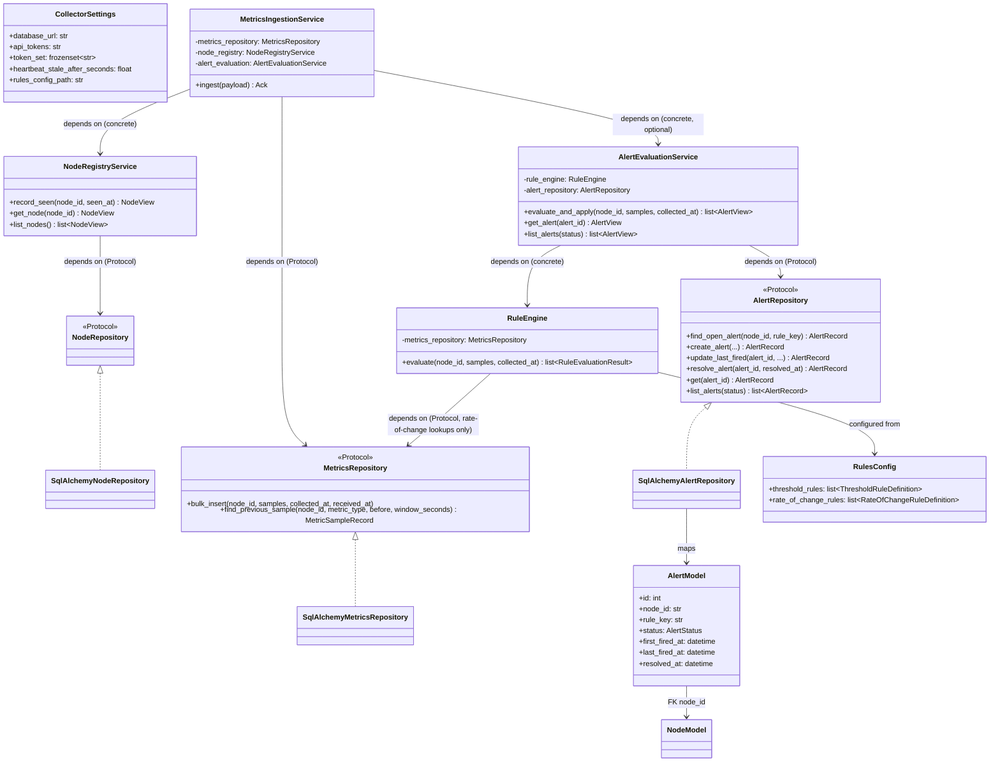
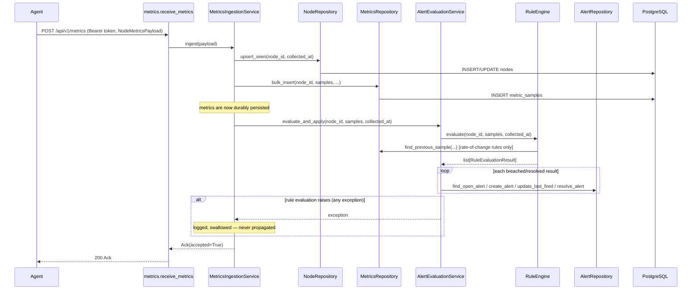
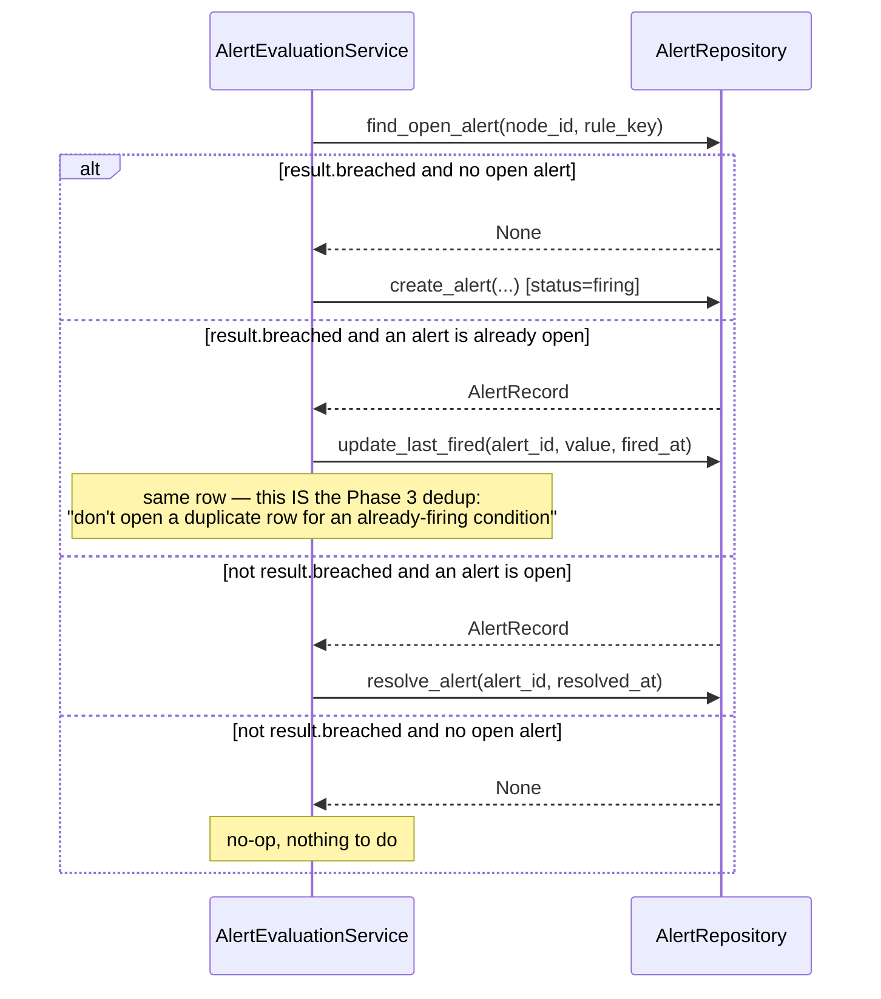

# Collector — Architecture

Related: `docs/architecture/00-project-initialization.md` (project-wide design),
`docs/adr/002-postgresql-choice.md`, `docs/adr/003-heartbeat-deadman-switch.md`,
`docs/adr/005-authentication.md`, `docs/adr/006-alert-lifecycle.md`,
`docs/adr/016-database-migration-strategy.md`, `docs/adr/017-collector-sync-vs-async-db.md`.

## Overview

The Collector is a FastAPI service layered as: **routes** (HTTP-facing, thin) → **services**
(business logic, framework-agnostic) → **repositories** (SQLAlchemy, the only layer that
knows about the database). Each layer depends only on the abstraction the layer below it
exposes — routes depend on services via FastAPI `Depends`, services depend on repository
`Protocol`s, never on SQLAlchemy or FastAPI directly. This mirrors the Agent's
`AgentScheduler` depending on `shared.protocols`, not concrete classes
(`agent/architecture.md`).

The Rule Engine (`collector/rules/`) is a peer of `repositories/`, not a sub-layer of it —
both are consumed by `services/`. `collector/enums.py` exists specifically so these two
peer packages (`rules/` evaluates, `repositories/` persists) can share the `RuleKind` and
`AlertStatus` vocabulary without either depending on the other.

## Class diagram

`NodeView`/`AlertView` (plain dataclasses returned by services) are distinct from
`NodeRead`/`AlertRead` (the Pydantic models `collector/api/schemas.py` serializes to
JSON) — the service layer never imports Pydantic/FastAPI, and the API layer never
imports SQLAlchemy models directly.

## Sequence diagram — metrics ingestion + rule evaluation

**Rule evaluation is best-effort by design.** It runs strictly *after* the metrics
transaction succeeds, and any exception from it — `PersistenceError` or a genuine bug
(`AttributeError`, `RuntimeError`, ...) — is caught, logged, and never surfaced as a
failed ingestion. This matters because the Agent's `HttpTransport` treats a non-2xx
response as retryable-or-fatal (`docs/adr/011-http-vs-message-queue.md`); a Rule Engine
bug must never cause the Agent to retry-storm re-delivering metrics that were already
safely persisted.

## Sequence diagram — Alert Lifecycle state machine

Two states only: `firing` → `resolved`. No `acknowledged`/`escalated` — those, plus
*notification-level* dedup ("don't re-notify Telegram every minute for the same
still-firing alert," a different concern from the row-level dedup above) and
escalation, are explicitly Phase 4 (`docs/adr/006-alert-lifecycle.md`).

## Why rule evaluation is ingestion-triggered, not scheduled

No background scheduler runs inside the Collector to periodically re-evaluate rules.
Evaluation happens synchronously, inline with `POST /api/v1/metrics`, immediately after
persistence succeeds. This avoids adding a scheduler/async-job dependency
(`docs/adr/017-collector-sync-vs-async-db.md`'s "no complexity without a demonstrated
need" philosophy applies here too) at the cost of never re-evaluating a node that has
gone completely silent — that's a *staleness* alert, a different, still-unimplemented
concern (see Future Extension Notes).

## Why rules are a JSON config file, not a database

`ROADMAP.md` names "Threshold Rules" and "Rate-of-change Rules," not a rule-management
API. A file, loaded once at startup (`collector/rules/loader.py`, stdlib `json`, zero new
dependency), fails Collector startup fast (`ConfigurationError`) on malformed content or
a duplicate rule for the same `(metric_type, kind)`. See `docs/adr/006-alert-lifecycle.md`.

## Why sync SQLAlchemy (not async)

FastAPI runs sync `def` route handlers in a threadpool automatically, so synchronous
repository code doesn't block the event loop. Given the Collector's expected request
volume (occasional pushes from a moderate node fleet, not high-frequency trading), the
complexity of `AsyncSession` (async repository methods, async test fixtures) wasn't
justified yet. See `docs/adr/017-collector-sync-vs-async-db.md`.

## Why Alembic, not `create_all()`

`Base.metadata.create_all()` has no history, no rollback path, and no story for applying
incremental schema changes to a running production database. Both migrations
(`0001_initial_schema.py`, `0002_alerts_table.py`) are hand-written, not autogenerated,
verified via generated offline SQL (`alembic upgrade head --sql`) rather than a live
database — see `docs/adr/016-database-migration-strategy.md`.

## Known limitation: shared-token auth doesn't bind identity

Any request bearing a valid token authenticates as "a legitimate Agent" — there is no
binding between a specific token and a specific `node_id`. A compromised or misconfigured
Agent could push data claiming another node's identity. This is a deliberate, documented
tradeoff (`docs/adr/005-authentication.md`), not an oversight — per-node credentials is
the natural next step once TLS/RBAC (`.claude/PROJECT.md` Future Features) are tackled.

## Known limitation: no flap-damping

A metric oscillating around a threshold across consecutive pushes opens and resolves the
same alert repeatedly ("churn") rather than requiring N consecutive breaches before
firing. Simplest correct behavior for "Alert Lifecycle" as literally named in
`ROADMAP.md` Phase 3; revisit if this becomes a real operational nuisance
(`docs/adr/006-alert-lifecycle.md`).

## Future Extension Notes

- **Per-node credentials**: replace the shared-token model once TLS/RBAC land, closing
  the identity-spoofing gap above.
- **Async DB access**: revisit if profiling shows threadpool contention under real load.
- **Alerting on staleness**: still not implemented. `NodeRegistryService.list_nodes()`
  exposes `is_stale` today, but nothing polls it — that requires a scheduler, which this
  phase deliberately did not add. A future phase adding *any* Collector-side background
  job should reconsider this at the same time.
- **Dynamic rule management**: a database-backed rule CRUD API (with hot-reload) is the
  natural successor to the static JSON config, if per-fleet/per-tenant customization
  becomes a real need.
- **Flap damping**: e.g. requiring N consecutive breaching evaluations before opening an
  alert, to reduce churn on noisy metrics.
- **Label-scoped rules**: rules currently apply per `metric_type` globally, not per label
  (e.g., a disk rule can't target one mount point specifically) — matches the Agent's
  current single-mount-point `DiskCollector`, so not a real functionality gap yet.
- **Telegram delivery, acknowledgement, escalation, notification-level dedup**: Phase 4,
  building on the `firing`/`resolved` alerts this phase produces.
- **Rate limiting**: not implemented; noted as a gap if the Collector is ever exposed
  beyond a trusted network.
