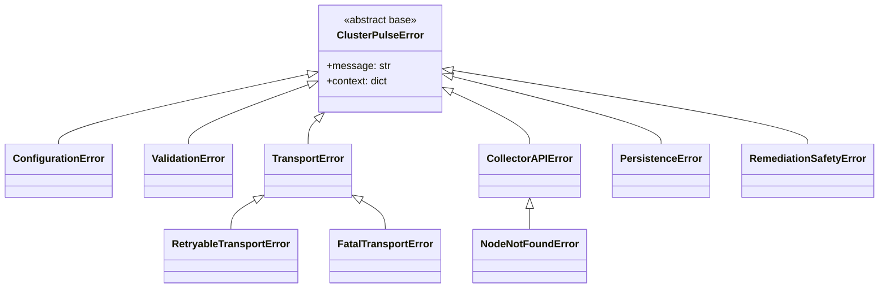

# ClusterPulse — Phase 0: Project Initialization Design Document

Status: DRAFT — for review
Phase: 0 (Repository, Development Environment, Tooling, Architecture)
Author: Principal Engineer (assistant), reviewed by: _pending_
Related: `.claude/PROJECT.md`, `.claude/ROADMAP.md`, `.claude/CODING_STANDARDS.md`, `.claude/DECISIONS.md`

This document contains **decisions and rationale only**. No application code is introduced
in this phase; only the structural and process scaffolding needed for Phase 1 (Agent) and
Phase 2 (Collector) to begin implementation against a stable foundation.

---

## 1. Requirements Recap

### 1.1 Functional scope (from `PROJECT.md` / `ROADMAP.md`)

ClusterPulse is a distributed Linux cluster health monitoring platform with (eventually)
safe auto-remediation. It is composed of two runtime processes plus supporting
infrastructure:

- **Agent** — runs on every monitored node, collects local health/metric data, pushes it
  to the Collector (ADR-002: push, not poll — simplifies firewalling/NAT).
- **Collector** — central FastAPI service (ADR-001), receives agent pushes, persists to
  PostgreSQL (ADR-003), owns node registry/heartbeat state.
- Future phases build on top of this substrate: Rule Engine → Alert Manager → Remediation
  Engine → Dashboard → Deployment/Chaos testing.

### 1.2 Constraints that shape Phase 0

| Constraint | Source | Architectural consequence |
|---|---|---|
| Agent runs on arbitrary Linux nodes, potentially many | ADR-002, `PROJECT.md` scale goals | Agent's dependency footprint must stay minimal (no FastAPI/SQLAlchemy). It only needs `httpx`, `psutil`, `pydantic`. |
| Collector is the system of record | ADR-001, ADR-003 | Collector owns FastAPI + SQLAlchemy + PostgreSQL; heavier footprint is acceptable since it runs once, centrally. |
| Agent and Collector must agree on wire format | ADR-002 (push model) | A single, versioned contract package is required — this is the `shared` package (§9). |
| Python 3.13, strong typing, SOLID, DI, explicit exceptions | `CLAUDE.md`, `CODING_STANDARDS.md` | Drives tooling choices (MyPy strict), exception hierarchy (§8), and module boundaries (§9). |
| Nothing generated wholesale; one module at a time | `CLAUDE.md` Rules | Phase 0 delivers structure + decisions only; Phase 1 implements the Agent against this foundation. |

### 1.3 Non-functional goals for Phase 0 specifically

- **Reproducibility**: any engineer can clone, `make setup`, `make test` and get an
  identical, green environment.
- **Enforceability**: standards in `CODING_STANDARDS.md` (max function/class length, no
  magic numbers, typed public functions) must be *checked by tooling*, not by convention.
- **Architectural integrity from day one**: the dependency direction `agent → shared` and
  `collector → shared` (never the reverse, never `agent ↔ collector`) must be structurally
  enforced so Phase 1/2 cannot silently create a distributed monolith.

---

## 2. Proposed Repository Structure

The top-level directories already exist (`agent/`, `collector/`, `shared/`, `docker/`,
`docs/`, `infra/`, `scripts/`, `tests/`) but are empty. Proposed internal layout (Phase 1/2
will populate these; **no files are created by this phase**, this is the target shape):

```
ClusterPulse/
├── agent/
│   ├── __init__.py
│   ├── main.py                  # entrypoint: wires config → collectors → scheduler → transport
│   ├── config.py                # AgentSettings(BaseSettings)
│   ├── collectors/               # psutil-based metric collectors (one module per metric family)
│   │   ├── __init__.py
│   │   ├── base.py               # Collector Protocol (interface)
│   │   ├── cpu.py
│   │   ├── memory.py
│   │   ├── disk.py
│   │   └── network.py
│   ├── scheduler.py              # periodic collection scheduling
│   ├── transport/
│   │   ├── __init__.py
│   │   └── http_client.py        # httpx client, retry/circuit-breaker wrapper
│   ├── buffer.py                 # local durable buffer for outage resilience
│   └── README.md / architecture.md
│
├── collector/
│   ├── __init__.py
│   ├── main.py                   # FastAPI app factory
│   ├── config.py                 # CollectorSettings(BaseSettings)
│   ├── api/
│   │   ├── __init__.py
│   │   ├── deps.py                # FastAPI dependency-injection providers
│   │   ├── routes/
│   │   │   ├── heartbeat.py
│   │   │   └── metrics.py
│   │   └── error_handlers.py      # exception → HTTP response mapping
│   ├── db/
│   │   ├── __init__.py
│   │   ├── session.py             # SQLAlchemy engine/session factory
│   │   ├── models/                # SQLAlchemy ORM models (persistence, NOT wire schemas)
│   │   └── migrations/            # Alembic
│   ├── repositories/               # data-access layer (interfaces + implementations)
│   ├── services/                   # business logic (node registry, heartbeat processing)
│   └── README.md / architecture.md
│
├── shared/                        # see §9 — the only thing agent/collector both import
│   ├── __init__.py
│   ├── contracts/
│   │   └── v1/                    # versioned wire models — the agent↔collector contract
│   ├── exceptions/
│   ├── logging/
│   ├── config/                    # BaseServiceSettings shared by agent & collector configs
│   ├── constants.py
│   ├── protocols.py               # structural interfaces (Collector, Transport, Repository)
│   └── README.md / architecture.md
│
├── infra/                         # IaC (future: Docker Compose today, Terraform/Ansible later)
├── docker/                        # agent.Dockerfile, collector.Dockerfile
├── scripts/                       # one-off/operational scripts (db bootstrap, load-test, etc.)
├── docs/
│   ├── architecture/              # this document lives here, plus one ADR-style doc per phase
│   └── diagrams/                  # rendered/mermaid sources
├── tests/
│   ├── unit/
│   │   ├── agent/
│   │   ├── collector/
│   │   └── shared/
│   ├── integration/
│   │   ├── agent_to_collector/    # contract/integration tests across the HTTP boundary
│   │   └── collector_db/          # tests against a real Postgres (docker-compose test profile)
│   └── conftest.py
├── .pre-commit-config.yaml        # proposed, see §5
├── pyproject.toml                 # existing
├── docker-compose.yml             # existing
├── Makefile                       # existing
└── README.md                      # existing
```

**Design rule enforced by this layout**: `shared/` has zero import edges pointing back
into `agent/` or `collector/`. `agent/` never imports from `collector/` and vice versa —
the HTTP contract in `shared/contracts/` is the *only* coupling between them. This will be
checked mechanically (§9.3), not just by convention.

---

## 3. Python Package Inventory & Rationale

Already declared in `pyproject.toml` — confirmed correct for Phase 0:

| Package | Used by | Why |
|---|---|---|
| `fastapi` | collector | ADR-001. Async-native, OpenAPI generation gives us free API docs, excellent testability via `TestClient`. |
| `uvicorn[standard]` | collector | ASGI server; `[standard]` pulls in `uvloop`/`httptools` for production performance. |
| `sqlalchemy` (2.x) | collector | ADR-003. 2.0-style typed ORM, async-capable if needed later, mature migration story via Alembic. |
| `psycopg[binary]` | collector | Modern, actively maintained PostgreSQL driver (psycopg3), async-capable. |
| `pydantic` (2.x) | shared, agent, collector | Runtime validation + typed models is the backbone of "explicit interfaces" and the agent↔collector contract (§9). |
| `pydantic-settings` | shared, agent, collector | 12-factor configuration loading with validation at startup (§4). |
| `httpx` | agent | ADR-002 push model needs an HTTP client; `httpx` gives sync+async, timeouts, and easy testability (`respx`/`pytest-httpx`). |
| `psutil` | agent | Cross-platform system metrics collection (CPU/mem/disk/net) without shelling out. |
| `pytest`, `pytest-asyncio` | tests | Standard async-aware test runner. |
| `ruff` | tooling | Lint + import ordering in one fast tool; replaces flake8+isort+pyupgrade. |
| `mypy` | tooling | Static typing enforcement (`CODING_STANDARDS.md`: "every public function has type hints"). |
| `black` | tooling | Deterministic formatting, removes style bikeshedding. |

### 3.1 Recommended additions (not yet in `pyproject.toml` — proposed for approval before Phase 1)

| Package | Scope | Why |
|---|---|---|
| `tenacity` | agent | Declarative retry/backoff for the push transport (transient network failures are the primary agent failure mode). |
| `alembic` | collector | Schema migrations for PostgreSQL — required as soon as `collector/db/models` exists. |
| `structlog` | shared | Structured, contextual JSON logging (§6) with clean stdlib-logging interop. |
| `pytest-cov` | tests | Coverage reporting/gating in CI. |
| `pytest-httpx` (or `respx`) | agent tests | Mock `httpx` calls in unit tests without a live server. |
| `freezegun` or `time-machine` | tests | Deterministic testing of scheduler/heartbeat timing logic. |
| `import-linter` | tooling | Mechanically enforces the dependency-direction rule in §2/§9.3 (fails CI if `shared` imports `agent` or `collector`, or if `agent` imports `collector`). |
| `pre-commit` | tooling | Runs ruff/black/mypy locally before commit, mirrors CI. |

None of these are installed in this phase — listed here so the decision is visible and can
be approved/rejected before Phase 1 implementation begins.

---

## 4. Configuration Strategy

**Decision: layered configuration via `pydantic-settings`, one `Settings` class per
service, sharing a common base from `shared/config`.**

```
shared/config/base.py     → BaseServiceSettings   (env_prefix-agnostic common fields)
agent/config.py           → AgentSettings(BaseServiceSettings)
collector/config.py       → CollectorSettings(BaseServiceSettings)
```

### 4.1 Layering (highest precedence last)

1. **Code defaults** — safe, non-secret defaults defined directly on the `Settings` class.
2. **Config file** (optional, `config.{yaml,toml}`, path supplied via env var) — for
   deployment-specific values that aren't secret (poll intervals, feature flags).
3. **Environment variables** — the primary mechanism (12-factor), prefixed per service
   (`CLUSTERPULSE_AGENT_*`, `CLUSTERPULSE_COLLECTOR_*`) to avoid collisions when both run
   on the same host during local dev.
4. **Process-level overrides** (CLI flags, where applicable) — highest precedence, for
   ad-hoc operational overrides (e.g. `--log-level debug`).

### 4.2 Rules

- **Fail fast**: settings are validated once at process startup (`Settings()` construction
  in `main.py`). A `ConfigurationError` (see §8) aborts startup with a clear message before
  any collector/scheduler/DB connection is attempted. No component should discover a
  misconfiguration lazily mid-operation.
- **No secrets in files committed to the repo.** Secrets (DB password, future
  auth tokens) come only from environment variables or a mounted secrets file path (never
  a literal value in `config.yaml`). `.env` is git-ignored and used for local dev only.
- **Shared fields, not shared values**: `BaseServiceSettings` defines the *shape* common to
  both services (`environment: Literal["dev","staging","prod"]`, `log_level`,
  `service_name`), but each service's actual `.env`/deployment config is independent —
  Agent and Collector are deployed and scaled independently (per ADR-002).

### 4.3 Failure scenarios

| Failure | Handling |
|---|---|
| Required env var missing | Pydantic validation error at startup → process exits non-zero with a human-readable message (logged to stderr, since structured logging isn't configured yet at that point). |
| Config file present but malformed | Same: fail fast, non-zero exit, no partial startup. |
| Config valid but semantically inconsistent (e.g. collector URL unreachable) | Not a config-load error — this is a runtime `TransportError`, handled by the retry/circuit-breaker layer (§8), not configuration validation. |

---

## 5. Code Quality Tooling

| Concern | Tool | Configuration approach |
|---|---|---|
| Formatting | `black` | `pyproject.toml` (already present); line-length aligned with Ruff (100). |
| Linting + import order | `ruff` | `pyproject.toml` `[tool.ruff]`; enable `E,F,I,B,UP,SIM` rule sets at minimum. Ruff replaces flake8/isort. |
| Static typing | `mypy` | `[tool.mypy]`, **strict mode incrementally**: start with `disallow_untyped_defs = true`, `warn_return_any = true`, `no_implicit_optional = true`; tighten to full `strict = true` once Phase 1/2 land, module by module via `[[tool.mypy.overrides]]` if needed. |
| Architecture boundaries | `import-linter` (proposed) | `.importlinter` contract: `shared` must not import `agent`/`collector`; `agent` must not import `collector` and vice versa. |
| Testing | `pytest` + `pytest-asyncio` + `pytest-cov` | `testpaths = ["tests"]` (already set). Coverage threshold gate added once first module lands (premature to set a % now). |
| Pre-commit enforcement | `pre-commit` (proposed) | Hooks: ruff (`--fix`), black, mypy (on changed files), end-of-file-fixer, trailing-whitespace. Mirrors what CI runs so failures are caught before push. |
| CI | GitHub Actions (or equivalent) | Job matrix: `lint`, `typecheck`, `test` — same `make` targets already defined (`make lint`, `make typecheck`, `make test`), so CI and local dev never drift. |

This maps directly onto the existing `Makefile` targets (`lint`, `format`, `typecheck`,
`test`) — no new tooling entrypoints needed, only configuration.

---

## 6. Logging Strategy

**Decision: `structlog` bound to stdlib `logging`, JSON renderer in non-dev environments,
console renderer in dev.**

### 6.1 Why not plain stdlib `logging`

`CODING_STANDARDS.md` mandates "logging instead of `print()`" but a distributed system
composed of many agent instances plus a central collector needs **structured, correlatable**
logs from day one — grepping free-text logs across dozens of agent nodes doesn't scale.
`structlog` gives us key-value structured events while still routing through stdlib
`logging` (so third-party libraries' log records are captured uniformly too).

### 6.2 Design

- `shared/logging/setup.py` exposes a single `configure_logging(settings: BaseServiceSettings) -> None`, called once at process startup by both `agent/main.py` and `collector/main.py`.
- Renderer selection by `environment`: `dev` → colored console renderer (human-readable);
  `staging`/`prod` → JSON renderer (machine-parseable, ready for ingestion by a log
  aggregator later).
- **Context binding, not string formatting**: every log call is `logger.info("heartbeat_sent", node_id=..., duration_ms=...)`, never f-string interpolation into the message. This keeps messages stable (good for log-based alerting/dashboards later) while details stay as structured fields.
- **Correlation identifiers**: 
  - Collector: a `request_id` is generated (or read from an inbound header) per HTTP request via FastAPI middleware and bound to `structlog.contextvars` for the life of the request — every log line inside that request carries it automatically.
  - Agent: a `collection_cycle_id` is bound per scheduler tick, so all logs from one collection-and-push cycle are correlatable.
- **No log line duplicates errors that are also raised** — an error is logged exactly once, at the boundary that handles it (§8), not at every layer it passes through.
- Uvicorn's own access logs are disabled in favor of a structlog-based access log middleware, so collector logs have one consistent shape.

### 6.3 Failure scenarios

| Failure | Handling |
|---|---|
| Logging misconfigured (bad log level string) | Falls back to `INFO`, emits one warning about the fallback — logging setup must never crash the process. |
| Log sink unavailable (e.g. stdout blocked) | Out of scope for Phase 0 (no external sink yet); noted as a future concern once shipping to a log aggregator (see §12). |

---

## 7. Error Handling Strategy

**Decision: an explicit, shared exception hierarchy; errors are translated at well-defined
boundaries, never swallowed silently.**

### 7.1 Exception hierarchy (`shared/exceptions/`)



- **`ClusterPulseError`** is the single root — a bare `except Exception` is only ever
  permitted at the top-level process boundary (main loop / FastAPI global handler), and
  even there it's logged with a full stack trace and re-raised or converted to a safe
  response — never silently discarded.
- **Retryable vs. fatal is an explicit type distinction**, not a flag: `RetryableTransportError`
  (timeouts, connection refused, 5xx) vs `FatalTransportError` (4xx auth/validation
  failures). This lets the retry policy (`tenacity`, agent transport layer) decide purely
  from the exception type, with no magic strings.

### 7.2 Boundary handling

| Boundary | Behavior |
|---|---|
| Collector FastAPI layer | `shared` exceptions caught in `collector/api/error_handlers.py`, translated to RFC 7807-style `problem+json` responses with correct HTTP status codes (e.g. `NodeNotFoundError` → 404, `ValidationError` → 422, `PersistenceError` → 503). |
| Agent transport layer | `RetryableTransportError` triggers `tenacity` backoff (bounded attempts + jitter); exhausting retries hands off to the local durable buffer (`agent/buffer.py`, Phase 1) instead of dropping data. `FatalTransportError` is logged and surfaced immediately — retrying a 401 endlessly is a bug, not resilience. |
| Agent/Collector startup | `ConfigurationError` → log + `sys.exit(1)`, no partial startup (§4.3). |
| Future Remediation Engine | `RemediationSafetyError` is reserved now so that when Phase 5 lands, "unsafe action attempted" is a first-class, distinguishable error from day one rather than retrofitted. |

### 7.3 Rules carried over from `CODING_STANDARDS.md`

- Every raised exception is one of the explicit `ClusterPulseError` subtypes — no bare
  `raise Exception(...)` or `raise ValueError(...)` in application code; stdlib exceptions
  are only allowed to escape from genuinely generic utility code, and even then get
  wrapped at the module boundary.
- Exceptions carry a `context: dict` for structured fields (e.g. `node_id`, `endpoint`) so
  the logging layer (§6) can log them as structured events, not just a message string.

---

## 8. Shared Module Structure

`shared/` is a normal installable Python package (already wired via
`[tool.setuptools.packages.find] include = ["agent*", "collector*", "shared*"]`) — both
`agent` and `collector` declare it as a regular import dependency, not via path hacks or
copy-paste.

```
shared/
├── __init__.py
├── contracts/
│   └── v1/
│       ├── __init__.py
│       ├── heartbeat.py      # HeartbeatPayload, HeartbeatAck
│       └── metrics.py        # NodeMetricsPayload, MetricSample, MetricType
├── config/
│   ├── __init__.py
│   └── base.py               # BaseServiceSettings
├── exceptions/
│   ├── __init__.py
│   ├── base.py                # ClusterPulseError
│   ├── transport.py
│   ├── persistence.py
│   └── remediation.py
├── logging/
│   ├── __init__.py
│   └── setup.py               # configure_logging()
├── protocols.py                # Collector, Transport, Repository — structural interfaces (PEP 544)
└── constants.py                 # Enums: Severity, MetricType, NodeStatus
```

### 8.1 Design rules

- **`shared` depends on nothing internal.** Its only third-party dependency is `pydantic`
  (+ stdlib). It must **not** depend on `fastapi` or `sqlalchemy` — those are
  collector-only concerns. This is what keeps the agent's footprint minimal (§1.2).
- **`shared` never imports from `agent` or `collector`.** Enforced by `import-linter`
  (§5) once introduced, so the rule is a build failure, not a review comment.
- **Interfaces over implementations**: `protocols.py` defines `Protocol` classes (e.g.
  `class Transport(Protocol): def send(self, payload: MetricsPayload) -> Ack: ...`).
  Concrete implementations live in `agent/transport/` or `collector/services/`. This is
  the mechanism for "Dependency Injection where appropriate" — `agent/main.py` constructs
  a concrete `HttpTransport` and injects it into the scheduler, which only depends on the
  `Transport` protocol from `shared`. Swapping in a fake transport for tests requires no
  inheritance, just a structurally-compatible object.

---

## 9. Model Sharing Between Agent and Collector

### 9.1 Problem

The Agent pushes data over HTTP to the Collector (ADR-002). Both processes must agree on
the exact shape of that payload. Duplicating the model definition in both `agent/` and
`collector/` would violate "no duplicated code" (`CODING_STANDARDS.md`) and — worse — would
let the two sides drift silently (a classic distributed-systems failure mode: agent and
collector deployed at different versions, disagreeing on schema, with no build-time
signal).

### 9.2 Decision

A single, versioned contract lives in `shared/contracts/v1/`, built from Pydantic models.
Both `agent` and `collector` import the *same* classes from the *same* package:

- **Agent** constructs a `shared.contracts.v1.metrics.NodeMetricsPayload`, serializes it
  (`.model_dump_json()`), and POSTs it.
- **Collector**'s FastAPI route declares that identical class as its request body type
  (`async def receive_metrics(payload: NodeMetricsPayload) -> Ack`) — FastAPI validates the
  inbound JSON against the exact same model the agent used to build it, and the OpenAPI
  schema is generated from it automatically.

There is exactly one definition of the wire format. There is no second "collector-side
DTO" that has to be kept in sync by hand.

### 9.3 Versioning & evolution

- Contracts live under `v1/`, not at the package root — when the payload needs a breaking
  change, `v2/` is added alongside it, the Collector can accept both during a rollout
  window, and the Agent fleet upgrades independently (important precisely because Agent is
  deployed on many nodes and can't be upgraded atomically). This directly serves the
  "Agent runs on arbitrary Linux nodes, potentially many" constraint from §1.2.
- Internal persistence models (`collector/db/models/`, SQLAlchemy ORM classes) are
  **deliberately a separate set of classes** from the wire contracts. The wire contract is
  an API/versioning concern; the ORM model is a storage concern. Collapsing them would mean
  a DB schema migration forces an API version bump (and vice versa) — coupling two things
  that change for different reasons. A thin mapping function in
  `collector/repositories/` converts contract → ORM model.
- **Enforcement**: `import-linter` contract additionally forbids `collector.db` from being
  imported anywhere except `collector.repositories`, keeping the ORM layer from leaking
  into API route signatures.

### 9.4 Why this satisfies SOLID/DI goals

- **Single Responsibility**: `shared/contracts` only defines shape + validation, nothing
  about transport or persistence.
- **Dependency Inversion**: both Agent and Collector depend on the *abstraction* (the
  contract model), not on each other's concrete internals.
- **Open/Closed**: adding `v2` contracts extends the system without modifying `v1`
  consumers.

---

## 10. Failure-Mode Review (per `CLAUDE.md` pre-implementation checklist, applied to Phase 0 itself)

| Question | Answer |
|---|---|
| What happens if this component fails? | Phase 0 has no runtime component — the "failure mode" is a tooling/config mistake reaching Phase 1. Mitigated by CI enforcing lint/type/test/import-boundary checks on every change from the first commit onward. |
| How is recovery handled? | Misconfiguration is caught at `Settings()` construction (fail-fast, §4); architectural violations are caught by `import-linter` in CI before merge, not discovered later in production. |
| Can this scale? | The structure scales by adding new collector modules (`agent/collectors/*.py`) or new API routes (`collector/api/routes/*.py`) without touching existing ones (Open/Closed) — and by adding `v2` contracts without breaking `v1` consumers. |
| Can this be tested independently? | Yes — `shared` has no dependency on `agent`/`collector` so it's unit-testable in isolation; `agent`'s transport layer depends on the `Transport` protocol so it's testable with a fake; `collector`'s routes depend on injected repositories (FastAPI `Depends`) so they're testable without a real database. |
| Can another engineer understand it? | The dependency direction is one-way and documented here; every module boundary maps to a directory; the contract package name (`v1`) makes versioning intent explicit rather than implicit. |

---

## 11. Future Extension Notes

- **Predictive Alerts / Rule Engine (Phase 3)**: will consume `shared.contracts.v1.metrics`
  directly — no new contract needed until its own output (alerts) needs a contract of its
  own (`shared/contracts/v1/alerts.py`).
- **TLS / RBAC**: additive to `shared/config` (new settings fields) and
  `collector/api/deps.py` (auth dependency) — does not require restructuring.
- **Prometheus Exporter**: would be a new route module under `collector/api/routes/`
  reading from the same repositories — no change to the contract or shared layer.
- **HA Collector**: the "collector owns Postgres" boundary (ADR-003) means HA is primarily
  a Postgres/infra concern (`infra/`), not an application-layer redesign — validates keeping
  persistence concerns out of `shared`.
- **Docker Deployment**: `docker/agent.Dockerfile` should install only the agent's minimal
  dependency set (§1.2) — worth revisiting `pyproject.toml` optional-dependency groups
  (`agent`, `collector`, `dev`) so the agent image doesn't pull in FastAPI/SQLAlchemy at
  all. Flagged here as a Phase 1 decision, not resolved now.

---

## 12. Open Questions for Review

1. Approve/reject the recommended package additions in §3.1 before Phase 1 starts
   installing them.
2. Confirm `structlog` (vs. stdlib `logging` + `python-json-logger`) is the preferred
   logging approach — it's a heavier dependency but more ergonomic for structured context
   binding.
3. Confirm splitting `pyproject.toml` dependencies into optional groups
   (`clusterpulse[agent]`, `clusterpulse[collector]`) so the Agent's install/Docker image
   doesn't require FastAPI/SQLAlchemy — currently all deps are in one flat list.
4. Confirm `import-linter` as the mechanism for enforcing the dependency-direction rule
   (alternative: a simple custom `scripts/check_import_boundaries.py` with no new
   dependency, if minimizing tooling surface is preferred).

---

## 13. Definition of Done for Phase 0

- [x] Requirements and constraints reviewed against `PROJECT.md`/`ROADMAP.md`/ADRs.
- [x] Repository structure proposed in detail (§2).
- [x] Package inventory justified (§3).
- [x] Configuration strategy designed (§4).
- [x] Code quality tooling recommended (§5).
- [x] Logging strategy designed (§6).
- [x] Error handling strategy designed (§7).
- [x] Shared module structure designed (§8).
- [x] Agent/Collector model-sharing mechanism explained (§9).
- [ ] **Pending**: sign-off on Open Questions (§12) before any Phase 1 code is written.
