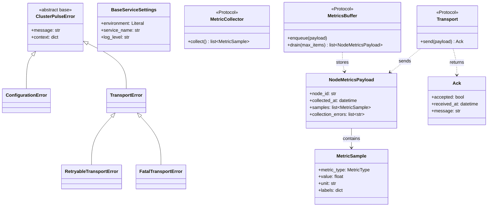
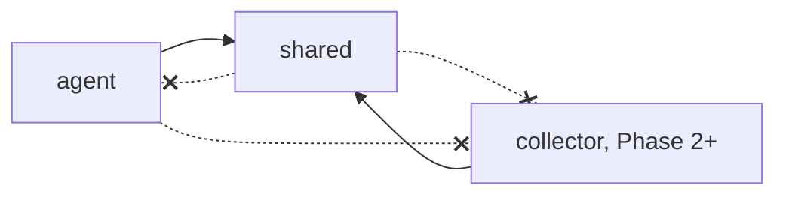

# Shared — Architecture

Related: `docs/architecture/00-project-initialization.md` §7–9.

## Class diagram

## Dependency-direction rule

Solid arrows are permitted imports; dashed-crossed arrows are forbidden. `shared` depends
on nothing internal. `agent` and `collector` never import each other — the versioned
contract in `shared/contracts` is the only coupling between them.

## Why exceptions are typed, not flagged

`RetryableTransportError` vs. `FatalTransportError` is a type distinction rather than an
`is_retryable: bool` field, so a `try/except RetryableTransportError` at the call site is
enough to express "retry this" — no risk of checking the wrong flag or forgetting to
check it at all.

## Future Extension Notes

- **`contracts/v2/`**: added alongside `v1`, never by editing `v1` in place, when a
  breaking wire-format change is needed — see `docs/architecture/00-project-initialization.md`
  §9.3 for why (independent Agent-fleet upgrade).
- **`RemediationSafetyError`** (`docs/adr/007-remediation-safety.md`, Phase 5): reserved
  in the design as a first-class exception category; not yet implemented since no
  remediation code exists yet.
- **`NodeStatus` / alert-related enums**: deferred until Phase 3 (Rule Engine) needs them
  — kept out of `constants.py` for now to avoid speculative additions with no consumer.
- **Import boundary enforcement**: currently a documented convention (this file + code
  review); `import-linter` was evaluated in Phase 0 (`docs/architecture/00-project-initialization.md`
  §12.4) as a way to make the dependency-direction rule a CI failure rather than a
  convention — not yet adopted, revisit if a violation actually slips through review.
